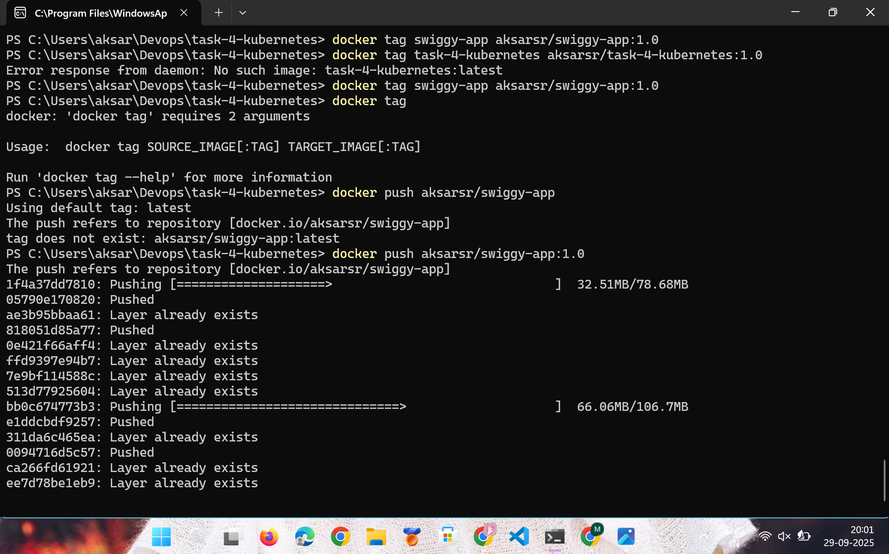
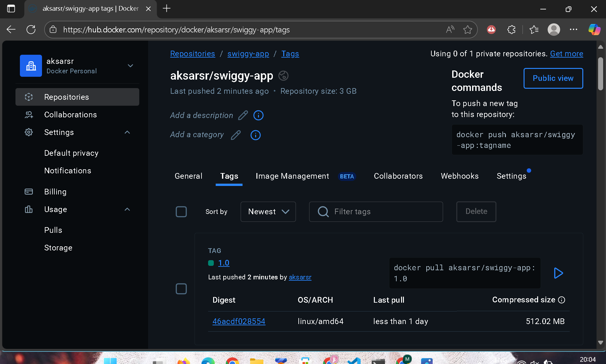
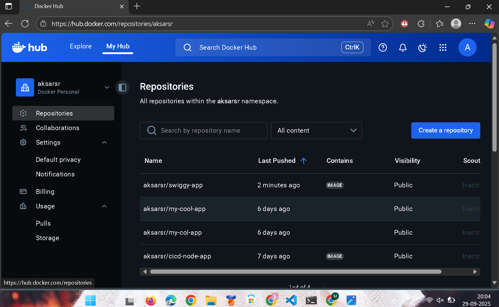
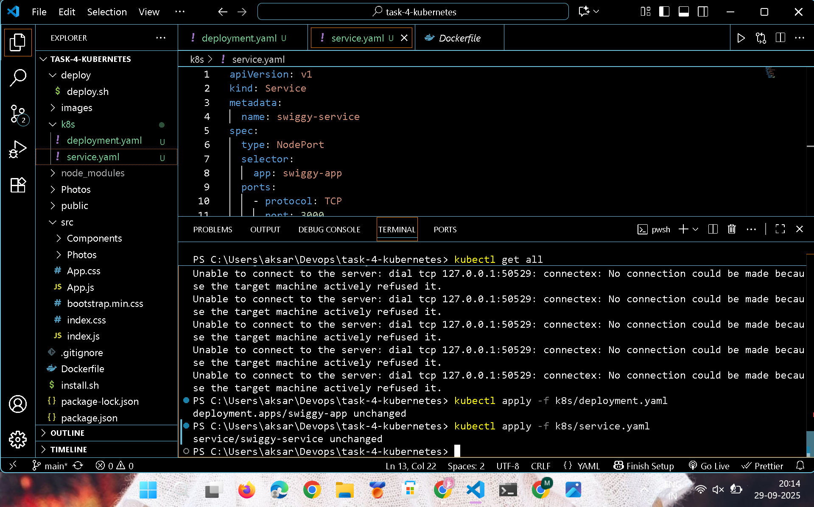
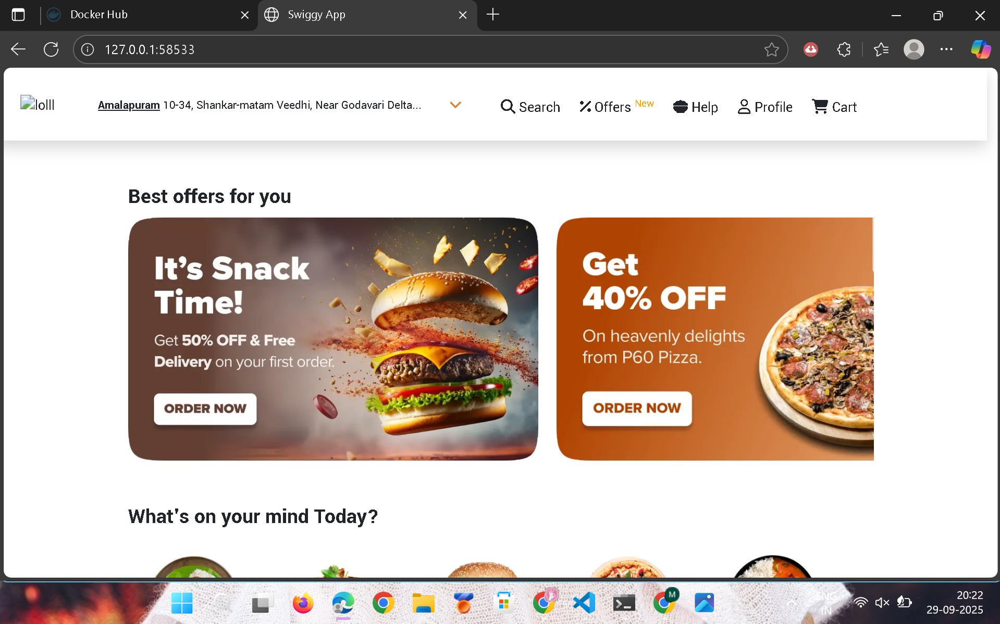
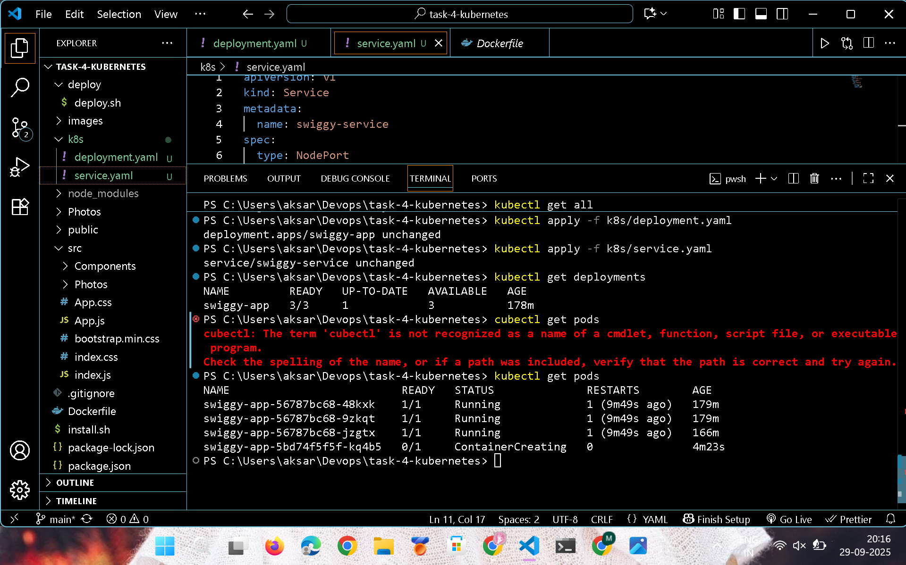
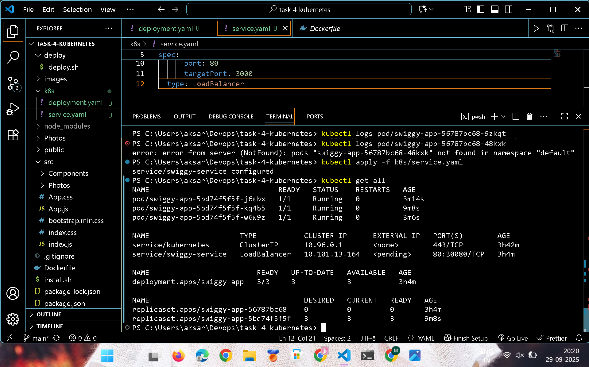
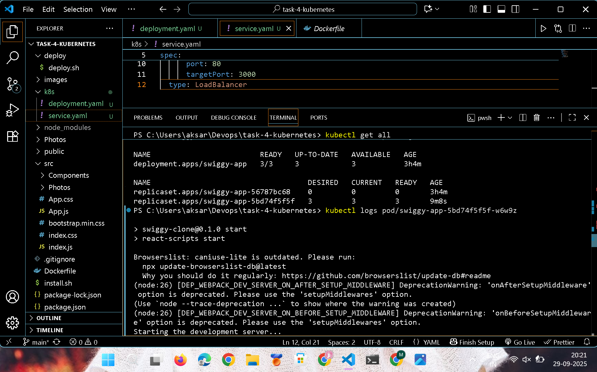
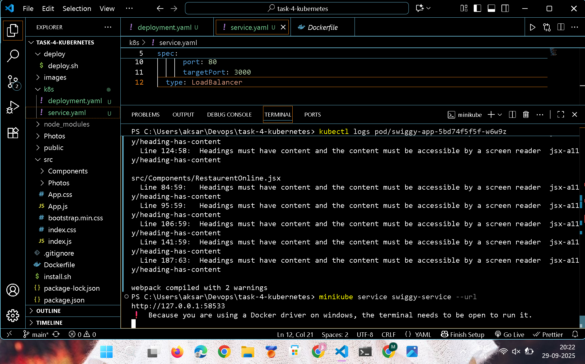
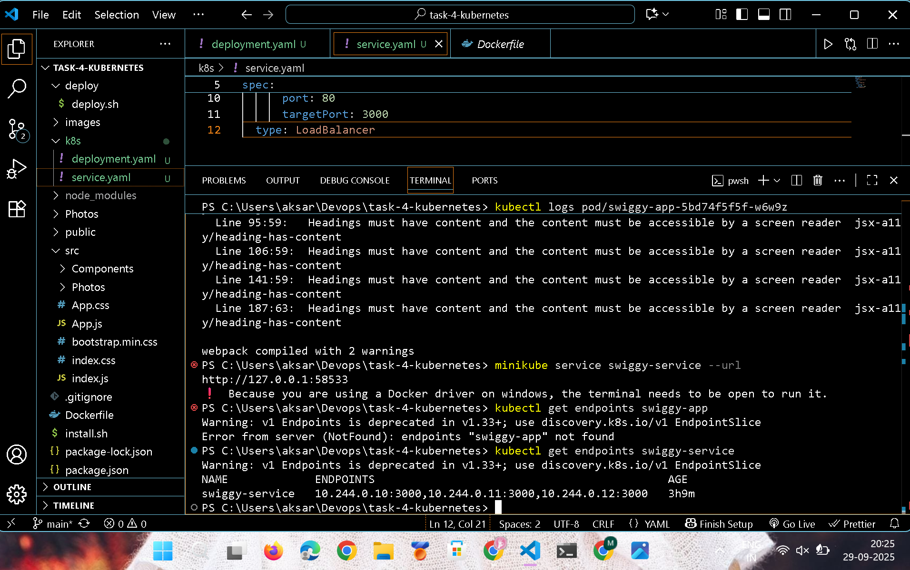

# TASK 5: Local Kubernetes Deployment with Minikube

This repository contains the files and documentation for deploying a Node.js application (a Swiggy clone) to a local Kubernetes cluster using Minikube. The setup leverages Docker to containerize the application and a Kubernetes Deployment and Service to manage its lifecycle.

## Objective

The goal of this task was to containerize a web application and deploy it to a local Kubernetes cluster to demonstrate an understanding of core container orchestration concepts.

## Prerequisites

To complete this task, the following tools were required:

- **Git**: For version control.
- **Node.js**: To run the application locally.
- **Docker**: To build and manage the application's container image.
- **Minikube**: To run a single-node Kubernetes cluster locally.
- **kubectl**: The command-line tool for interacting with the Kubernetes cluster.

## Application Setup & Containerization

1.  **Clone the Repository**:
    ```bash
    git clone [https://github.com/](https://github.com/)<your_github_username>/task-4-kubernetes.git
    cd task-4-kubernetes
    ```

2.  **Build the Docker Image**: A `Dockerfile` was created in the root directory to define the container environment. The image was built and tagged.
    ```bash
    docker build -t swiggy-app .
    ```

## Pushing to Docker Hub & Kubernetes Deployment

To make the image accessible to the Kubernetes cluster, it was pushed to Docker Hub. The Kubernetes manifests were then configured to pull from this registry.

1.  **Tag and Push the Docker Image**: The image was tagged with the Docker Hub username and then pushed to the public registry.
    ```bash
    docker tag swiggy-app:latest <your_dockerhub_username>/swiggy-app:1.0
    ```
    
    
    ```bash
    docker push <your_dockerhub_username>/swiggy-app:1.0
    ```
    
    


1.  **Kubernetes Manifests**: Separate `deployment.yaml` and `service.yaml` files were created to define the application's resources.

    * `deployment.yaml` (Manages Pods and Replicas):
        ```yaml
        apiVersion: apps/v1
        kind: Deployment
        metadata:
          name: swiggy-app
        spec:
          replicas: 3
          selector:
            matchLabels:
              app: swiggy-app
          template:
            metadata:
              labels:
                app: swiggy-app
            spec:
              containers:
              - name: swiggy-app
                image: aksarsr/swiggy-app:latest
                ports:
                - containerPort: 3000
        ```

    * `service.yaml` (Exposes the Application): A `LoadBalancer` service was used to expose the application externally.
        ```yaml
        apiVersion: v1
        kind: Service
        metadata:
          name: swiggy-service
        spec:
          selector:
            app: swiggy-app
          ports:
            - protocol: TCP
              port: 80
              targetPort: 3000
          type: LoadBalancer
        ```

2.  **Deploy to Minikube**:
    ```bash
    kubectl apply -f deployment.yaml
    kubectl apply -f service.yaml
    ```
    
   


## Accessing the Application

After deployment, the `minikube service` command was used to get the external URL to access the application.

```bash
minikube service swiggy-service
```


## OUTPUT




## Kubernetes Commands for Swiggy-Clone

This section contains the important `kubectl` and `minikube` commands used to manage, debug, and access the **Swiggy-Clone** application deployed on Kubernetes (via Minikube).

### Get Deployments
```bash
kubectl get deployments
```
- Lists all the deployments running in the Kubernetes cluster.
- Deployments manage ReplicaSets and Pods, ensuring the desired number of pod replicas are always running.

### Get Pods
```bash
kubectl get pods
```




- Displays all the pods in the current namespace along with their status (Running, Pending, CrashLoopBackOff, etc.).
- Pods are the smallest deployable units in Kubernetes, and they host the container(s) of your application.

### Get All Resources
```bash
kubectl get all
```


- Lists all resources in the current namespace such as Pods, Deployments, Services, ReplicaSets, etc.
- This command is useful for quickly checking the overall health of your application.

### View Pod Logs
```bash
kubectl logs pod/swiggy-app-5bd74f5f5f-w6w9
```

- Shows the logs of a specific pod.
- This is helpful for debugging issues inside the application container.

### Access Service URL via Minikube
```bash
minikube service swiggy-service --url
```


- Gets the external URL of the swiggy-service running in Minikube.
- Open this URL in your browser to access the deployed Swiggy-Clone application.

### Get Service Endpoints
```bash
kubectl get endpoints swiggy-service
```


- Lists the pod IPs and ports that are linked to the swiggy-service.
- This verifies whether the service is correctly routing traffic to the application pods.
